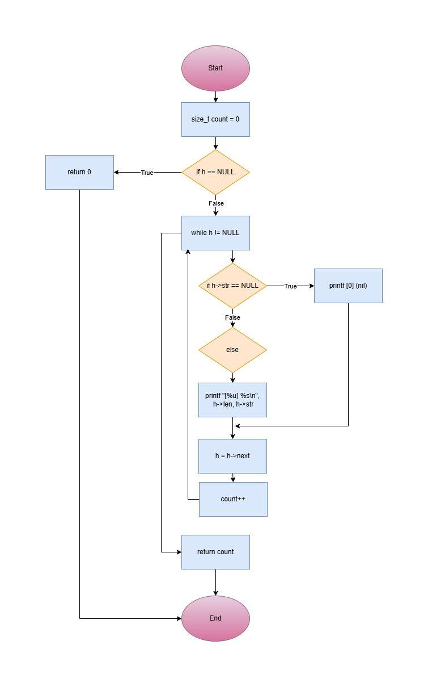
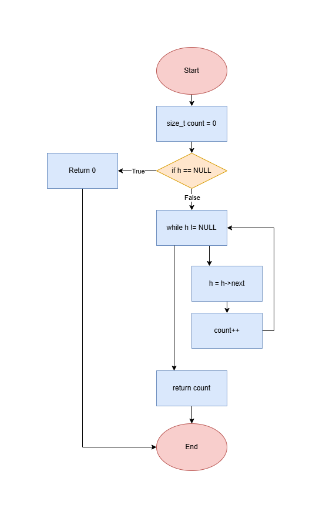
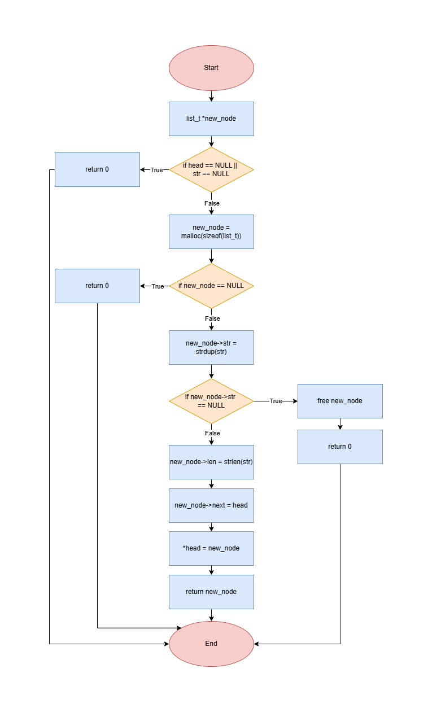
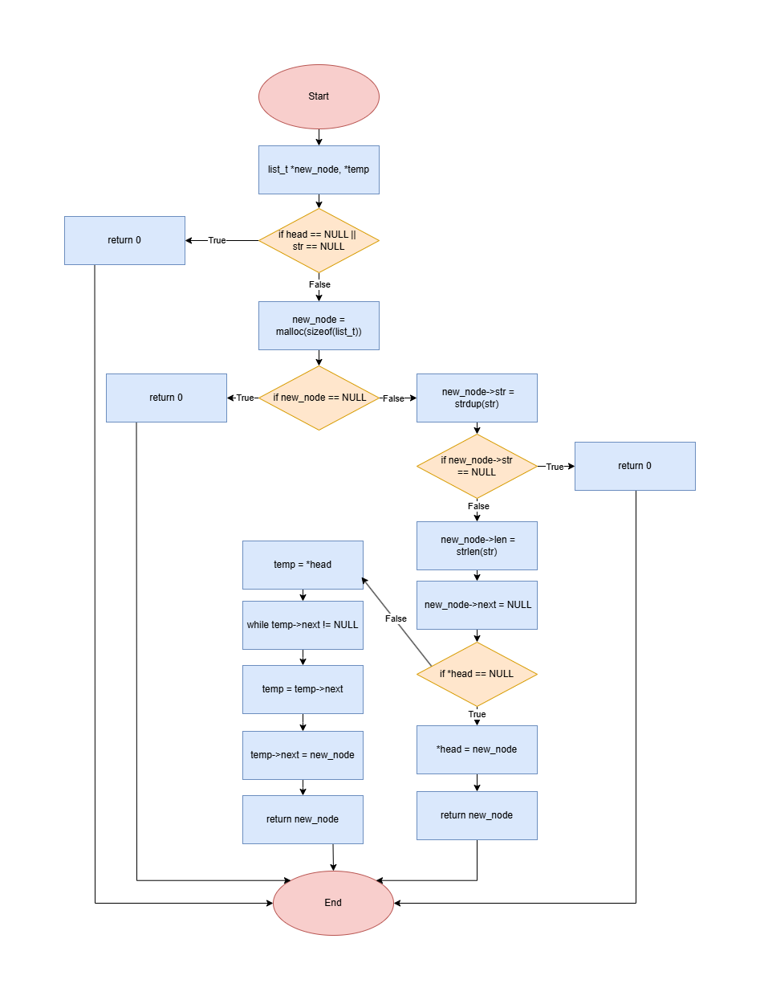

Project : C - Singly linked lists

Description

This project introduces the concept and implementation of singly linked lists in C.It covers how nodes are created, linked together, traversed, and freed.
The project is part of the Holberton School curriculum and focuses on understanding dynamic data structures, memory management, and pointer manipulation.

There are five tasks to complete in this project, and here is a brief summary of their objectives and an explanation of how they work,
and a description of the header file used to define the list structure and function prototypes.

1. 0-print_list.c

Objective :

Write a function that prints all the elements of a list_t list.

Prototype to use: size_t print_list(const list_t *h);
    * Return: the number of nodes
    * Format: see example
    * If str is NULL, print [0] (nil)
    * You are allowed to use printf

Explanation of the program:

The print_list function goes through a linked list of type list_t and prints each element. For every node, it checks whether the stored string is NULL.
If it is, the function prints [0] (nil); otherwise, it prints the length of the string followed by the string itself.
While traversing the list using the next pointers, the function keeps a count of all nodes it visits. When it reaches the end of the list, it returns the total number of nodes.
If the list is empty, it returns 0.

The flowchart below illustrates the main steps and logic of the program.

2. 1-list_len.c

Objective:

Write a function that returns the number of elements in a linked list_t list.

Prototype to use: size_t list_len(const list_t *h);

Explanation of the program:

The list_len function goes through a linked list of type list_t and counts how many nodes it contains.
It starts at the head of the list and moves from one node to the next using the next pointer, increasing a counter each time it visits a node.
Nothing inside the list is modified; the function only reads the nodes. When it reaches the end of the list, it returns the total number of nodes. If the list is empty, it returns 0.

The flowchart below illustrates the main steps and logic of the program.

3. 2-add_node.c

Objective:

Write a function that adds a new node at the beginning of a list_t list.

Prototype to use: list_t *add_node(list_t **head, const char *str);
    * Return: the address of the new element, or NULL if it failed
    * str needs to be duplicated
    * You are allowed to use strdup

Explanation of the program:

The add_node function creates a new node and places it at the beginning of a linked list of type list_t.
It starts by allocating memory for the new node and duplicating the string provided in str. If either allocation fails, the function returns NULL.
Once the string is stored and its length calculated, the new node is linked to the current head of the list, and the head pointer is updated to point to this new node.
Finally, the function returns the address of the newly added node.

The flowchart below illustrates the main steps and logic of the program.

4. 3-add_node_end.c

Objective:

Write a function that adds a new node at the end of a list_t list.

Prototype to use: list_t *add_node_end(list_t **head, const char *str);
    * Return: the address of the new element, or NULL if it failed
    * str needs to be duplicated
    * You are allowed to use strdup

Explanation of the program:

The add_node_end function adds a new node to the end of a linked list of type list_t. It first allocates memory for a new node and duplicates the string passed as an argument.
If either allocation fails, the function returns NULL. The length of the string is stored in the node, and its next pointer is set to NULL because it will become the last node in the list.
If the list is empty, the new node becomes the head. Otherwise, the function traverses the list until it reaches the last node and links the new node to the end.
Finally, it returns the address of the newly created node.

The flowchart below illustrates the main steps and logic of the program.

5. 4-free_list.c

Objective:

Write a function that frees a list_t list.

Prototype to use: void free_list(list_t *head);

Explanation of the program:

The free_list function goes through a linked list of type list_t and frees all its nodes to prevent memory leaks.
For each node, it first saves a pointer to the next node, then frees the string stored in the current node, and finally frees the node itself.
It continues this process until all nodes have been freed and the list is empty.

The flowchart below illustrates the main steps and logic of the program.

6. lists.h

The lists.h header file defines the list_s structure used for a singly linked list, where each node stores a string, its length, and a pointer to the next node.
It also declares the function prototypes for operating the linked list functions used throughout this project.
